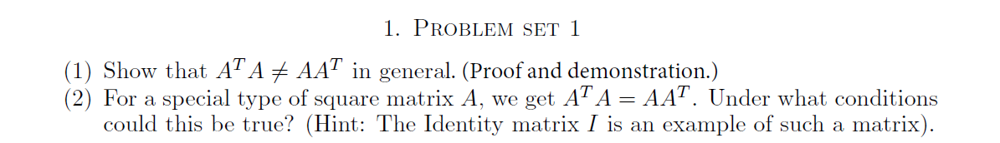
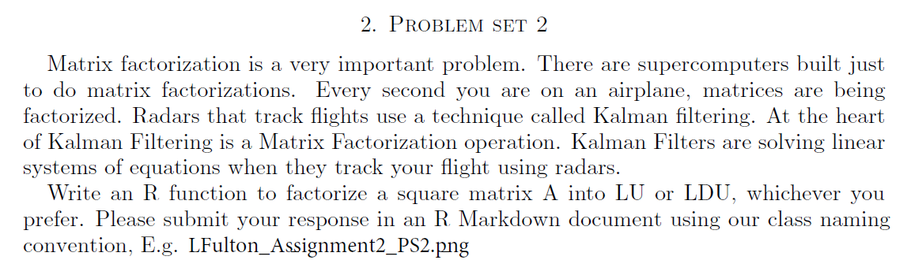

**_A: (1)_**

**_Consider a matrix A with i rows and j columns, _**

$A_{(i,j)} = \left[\begin{array}{cc}a_{1,1} & a_{1,2} & a_{1,3} & ..... & a_{1,j} \\a_{2,1} & a_{2,2} & a_{2,3} & ..... & a_{2,j} \\a_{3,1} & a_{3,2} & a_{3,3} & ..... & a_{3,j} \\. & . & . & ..... & .\\. & . & . & ..... & .\\. & . & . & ..... & .\\a_{i,1} & a_{i,2} & a_{i,3} & ..... & a_{i,j}\end{array}\right]$

**_Lets say values,_** $i \ne j$ **_and so on .... _**

$A_{(j,i)}^{T}$ **_will result in j rows and i columns._**

**_Transpose of A, _** $A^T = \left[\begin{array}{cc}a_{1,1} & a_{2,1} & a_{3,1} & ..... & a_{i,1} \\a_{1,2} & a_{2,2} & a_{3,2} & ..... & a_{i,2} \\a_{1,3} & a_{2,3} & a_{3,3} & ..... & a_{i,3} \\. & . & . & ..... & .\\. & . & . & ..... & .\\. & . & . & ..... & .\\a_{1,j} & a_{2,j} & a_{3,j} & ..... & a_{j,i}\end{array}\right]$

$A_{(i,j)}A_{(j,i)}^{T}$ **_will result in matrix of i rows and i columns,_** $AA_{(i,i)}^{T}$

$A_{(j,i)}^{T}A_{(i,j)}$ **_will result in matrix of j rows and j columns,_** $A^{T}A_{(j,j)}$

**_Hence,_** $A_{(i,j)}A_{(j,i)}^{T} \ne A_{(j,i)}^{T}A_{(i,j)}$

$AA_{(i,i)}^{T} \ne A^{T}A_{(j,j)}$

**_Example: Consider 4 X 5 matrix_**

$A = \left[\begin{array}{cc}1 & 1 & 1 & 1 & 3 \\3 & 2 & 1 & 2 & 4 \\2 & 1 & 0 & 2 & 1 \\1 & 1 & 1 & 1 & 3\end{array}\right]$

```{r, echo=T}
#4 X 5 matrix
A = matrix(c(1,3,2,1, 1,2,1,1, 1,1,0,1, 1,2,2,1, 3,4,1,3), nrow=4, ncol=5)


A

#transpose of matrix A, generates 5 X 4
tA = t(A)

tA

#generates 4 X 4 matrix
A%*%tA

#generates 5 X 5 matrix
tA%*%A
```

**_Outputs are different matrices with different values._**

**_A: (2)_**

**_When a matrix is symmetrical square matrix or identity matrix then _** $A_{(i,j)}A_{(j,i)}^{T} = A_{(j,i)}^{T}A_{(i,j)}$

```{r, echo=T}
#4 X 4 matrix 
A = matrix(c(9,1,3,6, 1,11,7,6, 3,7,4,1, 6,6,1,10), nrow=4, ncol=4)

A

#transpose of matrix A
#it is similar to A
tA = t(A)

tA

#matrix multiplication
A%*%tA

tA%*%A
```

**_Symmetric Square Matrix is one exception to the rule, where (i = j), _** 

$A_{(i,j)}A_{(j,i)}^{T} = A_{(j,i)}^{T}A_{(i,j)}$ = $AA_{(i,i)}^{T} = A^{T}A_{(j,j)}$

**_Similarly, for identity matrix_**

```{r, echo=T}
#4 X 4 identity matrix 
A = diag(4)

A

#transpose of matrix A
#it is similar to A
tA = t(A)

tA

#matrix multiplication
A%*%tA

tA%*%A
```
**_Identity matrix is another exception to the rule, where (i = j), _** 

$A_{(i,j)}A_{(j,i)}^{T} = A_{(j,i)}^{T}A_{(i,j)}$ = $AA_{(i,i)}^{T} = A^{T}A_{(j,j)}$




**_A:_**

**_Following function accepts a 5 X 5 square matrix and diagonal value to create identity matrix. It returns two matrices lower(L) and upper(U) decomposition._**

**_Function is coded based on https://www.youtube.com/watch?v=UlWcofkUDDU. _**

```{r, echo=T}
lud_function <- function(a,dia){
  #initiate identity matrix
  l = diag(dia)
  u = a
  
  #check if a[1,1] equal zero move it following row
  for (i in 1:nrow(u)){
    if (u[1,1] == 0){
      if (i+1 <= nrow(u)){
        swap = u[i+1,]
        u[i+1,] = u[1,]
        u[1,] = swap
        if (u[1,1] != 0){
          break
        }        
      }
    }
  }
  
  #Loop through every column and every row.
  #While working with column number 1 row number should be 2 (row > column)
  #For the first row, leave values as is
  #For the second row make first value zero
  #For the third row make first and second column values zero
  #Basically, we are doing row reduction echelon form, converting numbers on the lower side of diagonal to zero.
  #And saving factor value on lower side of identity matrix.
  
  k = 0
  #read columns
  for (j in 1:ncol(a)){
    k = k + 1
    #read rows
    for (i in 1:nrow(u)){
      #if row > column and value for the row is not equal to zero
      if (i > j){
        if (u[i,j] != 0){
          #initiate the sign of the factor
          s = -1
          if (u[i,j] < 0){
            if (u[k,j] < 0){
              #when both numbers are negative keep sign positive
              s = 1
            }
          }
          #calculate the factor
          f = s *  u[i,j]/u[k,j]
          #multiply upper row with the factor and sign
          swap1 = s * (u[k,] * u[i,j])/u[k,j]
          #get current row
          swap2 = u[i,]
          #add modified upper row to current row.
          #this should make row,column value to zero when addition is performed
          u[i,] = swap1 + swap2
          #record the factor
          l[i,j] = -1*f
        } 
      }
    }
  }
  return(list(l=l,u=u))
}

#get matrix
#a = matrix(c(1,-2,3, 4,8,4, -3,5,7), nrow=3, ncol=3)
#l = diag(3)
#a = matrix(c(1,2,0,0, 5,12,4,0, 0,5,13,6, 0,0,5,11), nrow=4, ncol=4)
#l = diag(4)

a = matrix(c(2,6,6,4,2, 3,1,3,2,1, 4,3,1,4,2, 1,1,2,7,4, 3,2,5,8,2), nrow=5, ncol=5)
m = lud_function(a,5)
#Lower matrix
m$l
#Upper matrix
m$u
```

**_Matrix multipication results in original matrix_**
```{r, echo=T}
#original matrix
a
```

```{r, echo=T}
#multipication of L and U
m$l%*%m$u
```

**_Both outputs match._**
